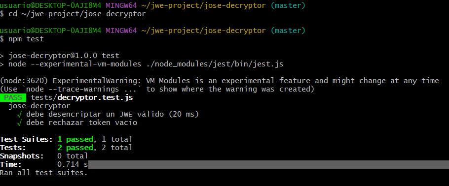
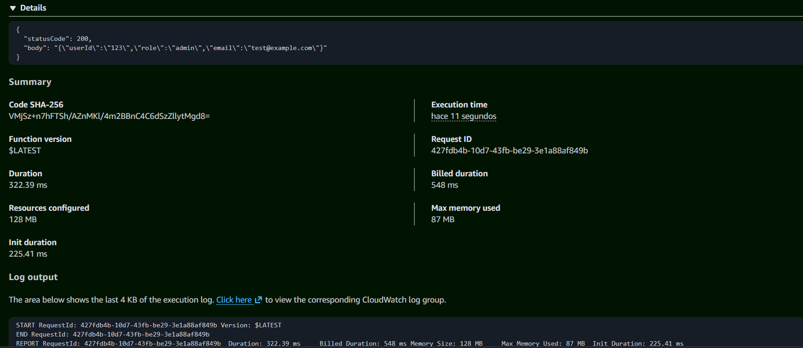

# 🔓 JOSE Decryptor

Lambda function que recibe un token JWE (JSON Web Encryption) y retorna el payload JSON desencriptado, usando criptografía asimétrica RSA.

---

## 🏗️ Arquitectura del sistema

```
┌──────────────────────────────────────────────────────────┐
│                     🔐 jwe-project                       │
│                                                          │
│   ┌─────────────────┐         ┌──────────────────────┐  │
│   │  🔐 encryptor   │         │  🔓 decryptor        │  │
│   │                 │         │                      │  │
│   │  payload JSON   │──JWE──► │  payload JSON        │  │
│   │  + public.pem   │         │  + private.pem       │  │
│   └─────────────────┘         └──────────────────────┘  │
│                                                          │
│   keys/public.pem  ◄── RSA PAIR ──► keys/private.pem    │
└──────────────────────────────────────────────────────────┘
```

---

## ⚙️ Algoritmos criptográficos

| Parámetro | Valor | Descripción |
|-----------|-------|-------------|
| `alg` | `RSA-OAEP-256` | Descifra la clave de encriptación |
| `enc` | `A256GCM` | Descifra el contenido del token |

---

## 📁 Estructura del proyecto

```
jose-decryptor/
├── .kiro/
│   └── specs/
│       ├── requirements.md
│       ├── design.md
│       └── tasks.md
├── src/
│   ├── handler.js
│   └── decryptor.js
├── tests/
│   └── decryptor.test.js
├── jest.config.js
└── package.json
```

---

## 📦 Dependencias

| Paquete | Versión | Uso |
|---------|---------|-----|
| `jose` | `^6.2.3` | Desencriptación JWE |
| `jest` | `^30.4.2` | Pruebas unitarias |

---

## 🚀 Instalación

```bash
cd jose-decryptor
npm install
```

---

## 🔓 Uso local

**Entrada esperada:**

```json
{
  "token": "eyJhbGciOiJSU0EtT0FFUC0yNTYiLCJlbmMiOiJBMjU2R0NNIn0..."
}
```

**Respuesta exitosa (200):**

```json
{
  "statusCode": 200,
  "body": "{\"payload\":{\"userId\":\"123\",\"role\":\"admin\"}}"
}
```

---

## ⚠️ Manejo de errores

**Payload inválido (400):**

```json
{
  "statusCode": 400,
  "body": "{\"error\":\"Token inválido\"}"
}
```

**Error interno (500):**

```json
{
  "statusCode": 500,
  "body": "{\"error\":\"Error al desencriptar el token\"}"
}
```

---

## 🧪 Pruebas unitarias

**Ejecutar tests:**

```bash
npm test
```

**Casos de prueba:**

| Test | Escenario | Resultado esperado |
|------|-----------|--------------------|
| ✔ Happy path | Token válido | `statusCode: 200` |
| ❌ Error input | Token `null` | `statusCode: 400` |
| 💥 Crypto fail | Token corrupto | `statusCode: 500` |

**Código de pruebas:**

```js
import { handler } from '../src/handler.js';

describe('🔓 jose-decryptor', () => {
  test('✔ debe desencriptar token válido', async () => {
    const response = await handler({ token: 'mock-valid-jwe' });
    expect(response.statusCode).toBe(200);
    const body = JSON.parse(response.body);
    expect(body.payload).toBeDefined();
  });

  test('❌ debe rechazar token inválido', async () => {
    const response = await handler({ token: null });
    expect(response.statusCode).toBe(400);
  });
});
```

---

## 📥 Evidencia de funcionamiento

**Input:**

```json
{
  "token": "eyJhbGciOi..."
}
```

**Output:**

```json
{
  "payload": {
    "nombre": "Wilmer",
    "rol": "admin"
  }
}
```
# Capturas de test e integracion



