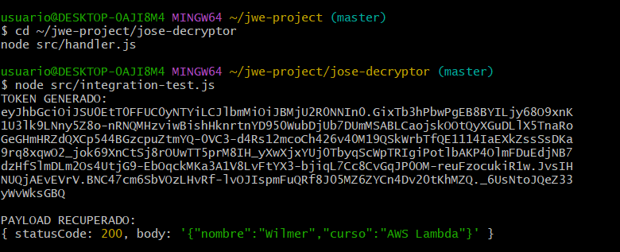
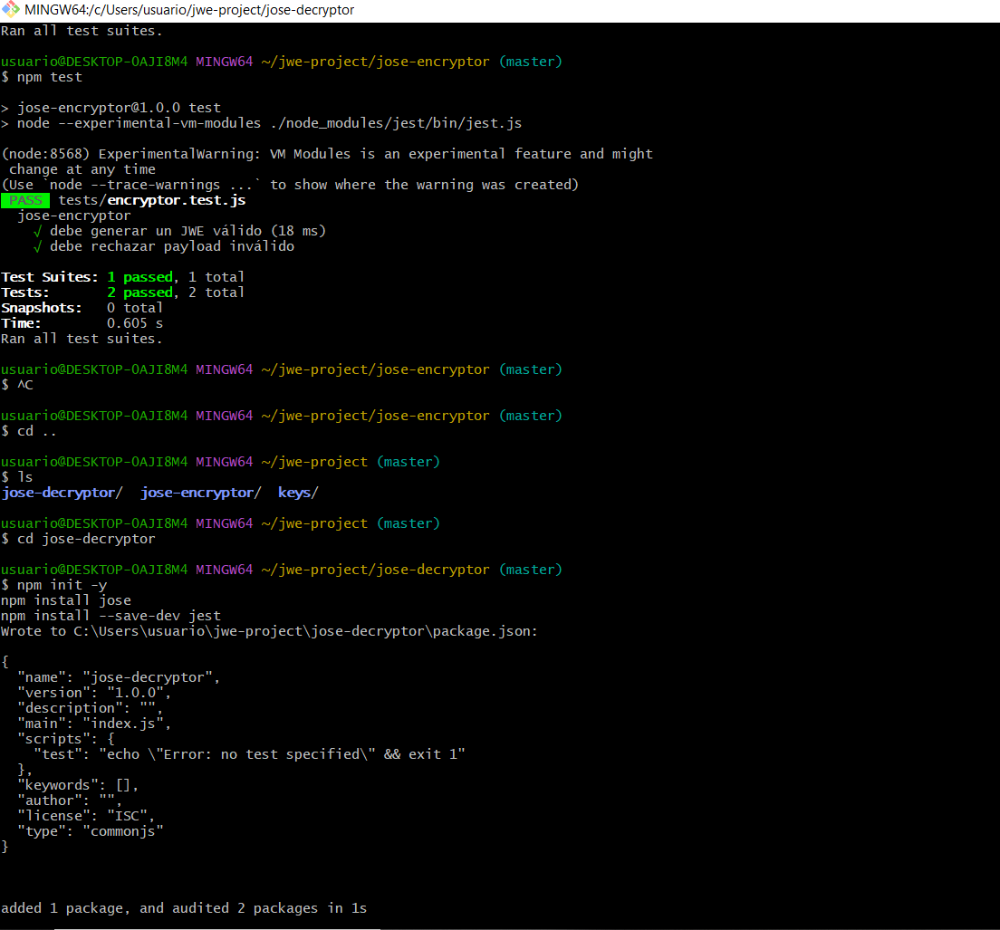
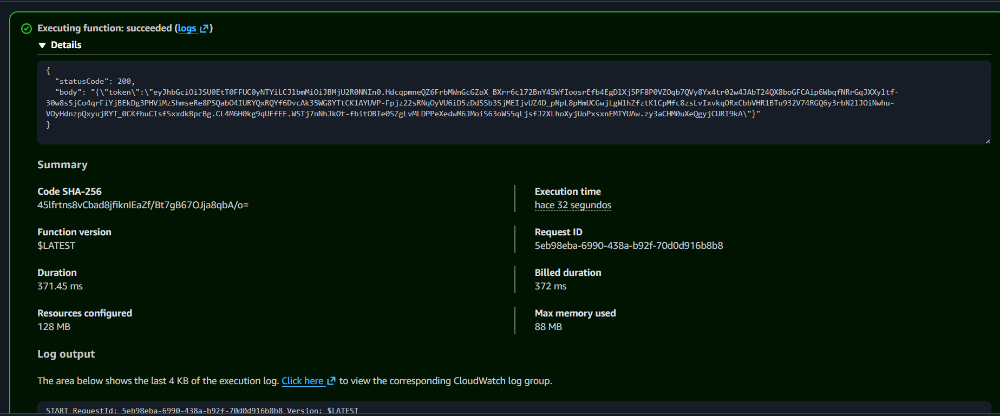

# jose-encryptor

Lambda function que recibe un payload JSON y retorna un token **JWE (JSON Web Encryption)** encriptado con criptografía asimétrica RSA.

---

## Arquitectura

```
┌──────────────────────────────────────────────────────────┐
│                     jwe-project                          │
│                                                          │
│   ┌─────────────────┐         ┌──────────────────────┐  │
│   │  jose-encryptor │         │   jose-decryptor     │  │
│   │                 │         │                      │  │
│   │  payload JSON   │──JWE──► │  payload JSON        │  │
│   │  + public.pem   │         │  + private.pem       │  │
│   └─────────────────┘         └──────────────────────┘  │
│                                                          │
│   keys/public.pem  ◄──── par RSA ────► keys/private.pem │
└──────────────────────────────────────────────────────────┘
```

### Algoritmos Criptográficos

| Parámetro | Valor        | Descripción                              |
|-----------|--------------|------------------------------------------|
| `alg`     | RSA-OAEP-256 | Encriptación de la Content Encryption Key |
| `enc`     | A256GCM      | Encriptación del contenido (AES-256-GCM) |

---

## Estructura del Proyecto

```
jose-encryptor/
├── .kiro/
│   └── specs/
│       ├── requirements.md   ← Requerimientos funcionales
│       ├── design.md         ← Diseño técnico y decisiones
│       └── tasks.md          ← Tareas SDD completadas
├── src/
│   └── handler.js            ← Handler principal de la Lambda
├── tests/
│   └── encryptor.test.js     ← Pruebas unitarias (Jest)
├── jest.config.js
└── package.json
```

---

## Dependencias

| Paquete | Versión  | Uso                              |
|---------|----------|----------------------------------|
| `jose`  | ^6.2.3   | Encriptación JWE (RFC 7516/7518) |
| `jest`  | ^30.4.2  | Framework de pruebas unitarias   |

---

## Instalación

```bash
cd jose-encryptor
npm install
```

---

## Uso Local

El handler acepta un evento con la siguiente estructura:

```json
{
  "payload": {
    "userId": "123",
    "role": "admin",
    "data": "cualquier objeto JSON"
  }
}
```

### Ejemplo de respuesta exitosa (200)

```json
{
  "statusCode": 200,
  "body": "{\"token\":\"eyJhbGciOiJSU0EtT0FFUC0yNTYiLCJlbmMiOiJBMjU2R0NNIn0.abc123...\"}"
}
```

El token JWE tiene el formato **Compact Serialization** con 5 partes separadas por `.`:
```
HEADER.ENCRYPTED_KEY.IV.CIPHERTEXT.AUTH_TAG
```

### Ejemplo de error — Payload inválido (400)

```json
{
  "payload": null
}
```

```json
{
  "statusCode": 400,
  "body": "{\"error\":\"Payload inválido\"}"
}
```

---

## Pruebas Unitarias

### Ejecutar tests

```bash
npm test
```

### Casos de prueba

| Test | Escenario | Resultado esperado |
|------|-----------|--------------------|
| Happy path | Payload válido `{ nombre: 'Wilmer' }` | `statusCode: 200`, `body.token` definido y tipo string |
| Error path | Payload `null` | `statusCode: 400` |

### Código de las pruebas

```javascript
// tests/encryptor.test.js
import { handler } from '../src/handler.js';

describe('jose-encryptor', () => {

  test('debe generar un JWE válido', async () => {
    const response = await handler({ payload: { nombre: 'Wilmer' } });
    expect(response.statusCode).toBe(200);
    const body = JSON.parse(response.body);
    expect(body.token).toBeDefined();
    expect(typeof body.token).toBe('string');
  });

  test('debe rechazar payload inválido', async () => {
    const response = await handler({ payload: null });
    expect(response.statusCode).toBe(400);
  });

});
```

### Evidencia de ejecución de tests

> 📸 **Captura requerida:** Ejecuta `npm test` en tu terminal y toma una captura de pantalla del resultado. Reemplaza esta sección con la imagen.

```
PASS tests/encryptor.test.js
  jose-encryptor
    ✓ debe generar un JWE válido
    ✓ debe rechazar payload inválido

Test Suites: 1 passed, 1 total
Tests:       2 passed, 2 total
```

**Instrucciones para agregar la captura:**
1. Corre `npm test` en tu terminal
2. Toma screenshot del resultado
3. Guarda la imagen como `docs/tests-result.png`
4. Reemplaza el bloque de texto anterior con:

```markdown

```

---

## Evidencia de Funcionamiento

### Payload de entrada

> 📸 **Captura requerida:** Muestra el evento JSON que enviaste en la consola de AWS Lambda o en una prueba local.

```json
{
  "payload": {
    "nombre": "Wilmer",
    "rol": "admin"
  }
}
```

**Instrucciones:**
1. Ejecuta la lambda localmente o desde la consola AWS
2. Captura el input y el output
3. Guarda como `docs/encrypt-input.png` y `docs/encrypt-output.png`
4. Agrega las imágenes aquí:

```markdown
**Input:**


**JWE resultante:**

```

---

## Despliegue en AWS Lambda

Ver la guía completa de despliegue en el [README principal del repositorio](../README.md#despliegue-en-aws).

### Configuración rápida

| Parámetro | Valor |
|-----------|-------|
| Runtime | Node.js 20.x |
| Handler | `src/handler.handler` |
| Timeout | 10 segundos |
| Memoria | 128 MB |
| Archivos incluidos | `src/`, `keys/public.pem`, `node_modules/`, `package.json` |

> ⚠️ **Nota de seguridad:** Solo `public.pem` se incluye en este deployment package. `private.pem` nunca debe estar en esta lambda.

---

## Spec-Driven Development

Este módulo fue desarrollado siguiendo la metodología **SDD**:

| Archivo | Contenido |
|---------|-----------|
| `.kiro/specs/requirements.md` | Requerimientos funcionales y no funcionales |
| `.kiro/specs/design.md` | Arquitectura, flujo y decisiones técnicas |
| `.kiro/specs/tasks.md` | Tareas de implementación con trazabilidad a RF |


## 🧪 Resultados de pruebas
# Capturas de test e integracion




